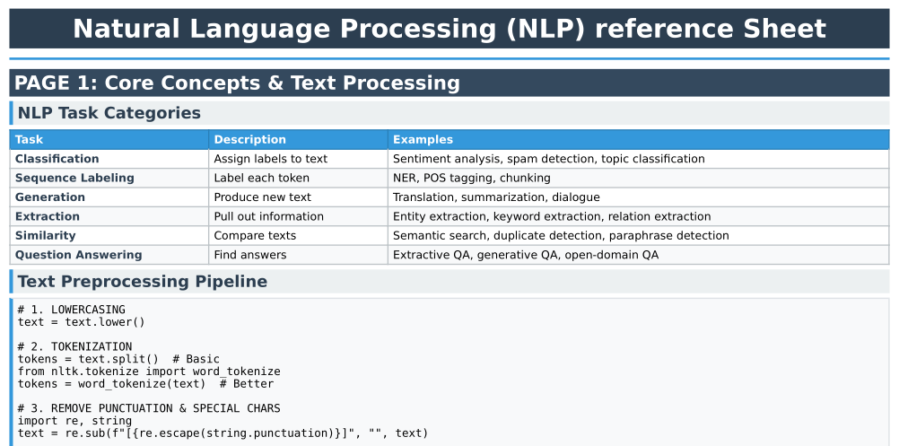

# NLP Reference Sheet

A comprehensive, quick reference sheet for Natural Language Processing concepts and techniques.

[](https://github.com/dannyblaker/)

### Screenshot



## Files

- `nlp_reference_sheet.md` - The main NLP reference document in Markdown format
- `convert_to_pdf.py` - Python script to convert the reference sheet to PDF format
- `requirements.txt` - Python dependencies
- `Dockerfile` - Docker image configuration
- `docker-compose.yml` - Docker Compose configuration

## Usage

### Quick Start with Docker

Simply run:

```bash
docker compose up
```

This will:
1. Build the Docker image with all required dependencies
2. Generate the PDF file (`nlp_reference_sheet.pdf`)
3. Save the PDF in your current directory

### Manual Setup (Alternative)

If you prefer not to use Docker:

1. Create a virtual environment: `python3 -m venv venv`
2. Activate it: `source venv/bin/activate` (Linux/Mac) or `venv\Scripts\activate` (Windows)
3. Install dependencies: `pip install -r requirements.txt`
4. Run the script: `python convert_to_pdf.py`
